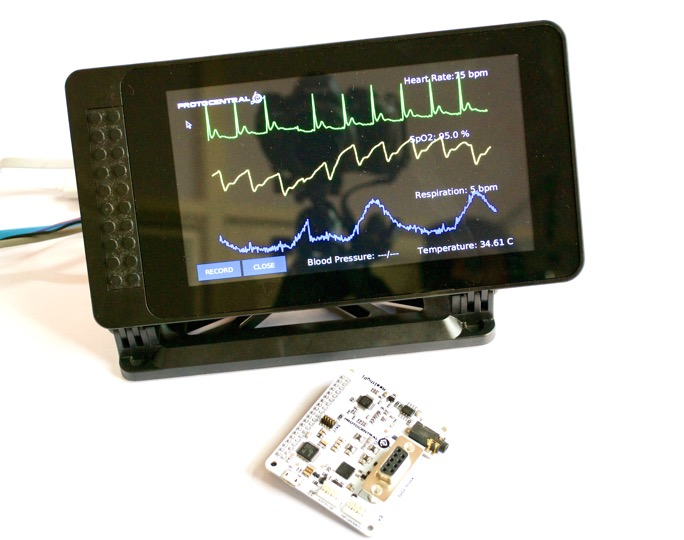
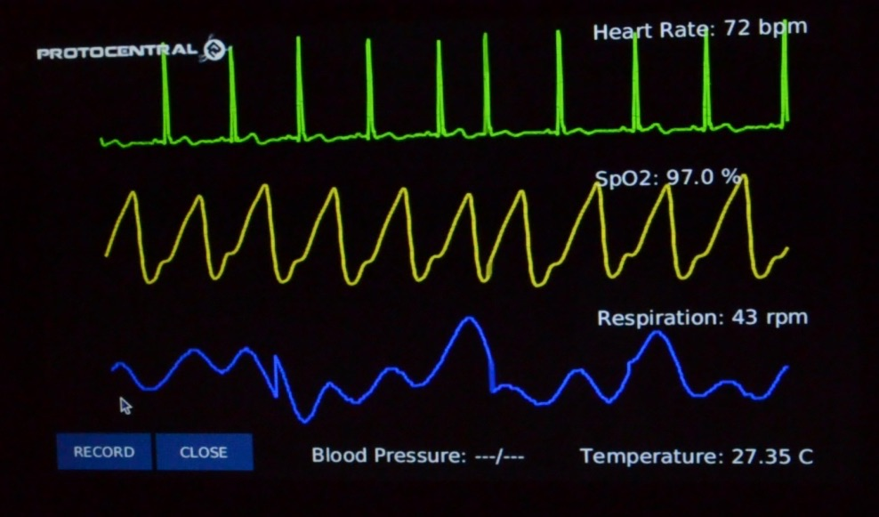
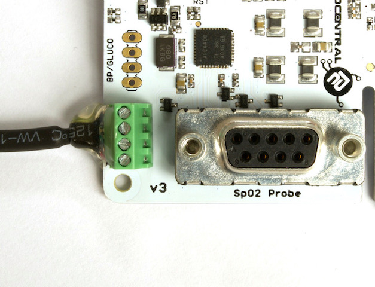

HealthyPi is the first fully open-source, full-featured vital sign monitor. Using the Raspberry Pi as its computing and display platform, the HealthyPi add-on HAT turns the Raspberry Pi into a vital sign monitoring system.

If you don't already have one, you can buy [HealthyPi at Crowd Supply](https://www.crowdsupply.com/protocentral/healthypi-v3).

Repository Contents
-------------------
* **/firmware** - Atmel studio and Arduino example sketches.
* **/Hardware** - All Eagle design files (.brd, .sch)
* **/extras** - includes the datasheet
* **/gui** - HealthyPi GUI for Raspberry Pi and PC
* **/docs** - Additional Documentation

# Getting Started with HealthyPi

The HealthyPi was designed with not just one application in mind, but a variety of them. While it does function as a vital sign monitor for traditional patient monitoring applications, it can also be used for several other applications. You can use it with a Raspberry Pi using a display; use it with a Raspberry Pi with the official touchscreen using our “Complete Kit,” or you can use it standalone by connecting it to any computer’s USB port. The software is compatible across all platforms.

## Getting started with the HealthyPi Complete Kit

If you have purchased the "HealthyPi Complete Kit", then it would already come with a Raspberry Pi and microSD storage with all the HealthyPi software pre-loaded and configured on it. Just plug it in and it should work.

You would still need to assemble the display enclosure and the display stand for the provided [SmartiPi Touch Case](https://smarticase.com/collections/all/products/smartipi-touch). The SmartiPi Touch that comes included with the HealthyPi kit is already partly assembled. Check out the below video for instructions on how to assemble the kit.

<iframe src="https://player.vimeo.com/video/225759990" width="640" height="360" frameborder="0" webkitallowfullscreen mozallowfullscreen allowfullscreen></iframe>


## Getting started with HealthyPi on Raspberry Pi

If you have a Raspberry Pi setup already available, just follow the following steps on your Raspberry Pi. You will need a monitor and a keyboard/mouse and the Raspberry Pi should be running Raspbian before proceeding with HealthyPi installation. To find out how to install Raspbian check out this great tutorial on Raspberry Pi's official site.

The following video shows you how to connect the HealthyPi to a Raspberry Pi.

<iframe src="https://player.vimeo.com/video/226236581" width="640" height="360" frameborder="0" webkitallowfullscreen mozallowfullscreen allowfullscreen></iframe>


After completing the steps shown in the video, open up the terminal window (Menu -> Accessories -> Terminal) on Raspbian running on your Raspberry Pi:


In the terminal window, type the following lines.

```bash
curl -sS http://pi.protocentral.com/hpi3.sh | sudo bash
```

Follow the instructions shown carefully, this will download and install all that is required to get the HealthyPi running.

It really is as simple as that. This code will install all the required overlays, configuration and application files to get the Healthy Pi up and running.

After the script reboots your Raspberry Pi, you should be able to see the GUI display the sensor outputs in real-time on the screen.



**This completes the install!**


## Getting started with the HealthyPi GUI on Windows, MacOS and Linux

The HealthyPi board now streams the same data on the on-board USB port. This allows you to get the same data that goes to the Raspberry Pi, now on your desktop PC as well.

<iframe src="https://player.vimeo.com/video/225754981" width="640" height="360" frameborder="0" webkitallowfullscreen mozallowfullscreen allowfullscreen></iframe>

*Java 8 is required on all platforms for running the processing-based GUI application. You can download Java for your platform from the following link.*

[https://java.com/en/download/](https://java.com/en/download/)

### Installing drivers (only for Windows)

HealthyPi uses the same drivers as an Arduino Zero. Once plugged in to the USB port, the device would be recognized as an "Unknown Device". You can locate the device is the Windows Device Manager and manually install the drivers provided in the "drivers" folder in the Windows Executable ZIP archive provided.

MacOS and Linux do not need any drivers to be installed.

### Processing GUI Installation

Download the zip file containing the executable files from the following links for 32-bit/64-bit Windows. If you do not know if you have a 64-bit or 32-bit computer, try with the 32-bit version.

[Download the latest release here](https://github.com/Protocentral/protocentral-healthypi-v3/releases/tag/v1.0)

Simply download the appropriate file for your operating system, unzip the contents and run the executable program contained in it.

# Connecting the sensors

## Connecting the ECG/Respiration Electrodes

A 3-electrode cable along with a standard stereo jack is provided along with the shield to connect the electrodes to the  board.
The other side of the electrode connector would connect to snap-on electrodes attached to the body. For testing purposes, you can use an ECG simulator to provide inputs to the board.


**Important Warning:**
When connecting the electrodes to the body, it is safer to disconnect the mains power source to the Arduino. For example, if  you are using the Arduino along with a laptop, disconnecting the battery charger from the laptop would be a safe option.

Place the electrodes on the body in these positions to get the best signal. However, placing it in other positions on the chest would work as well with differing ECG signal patterns. For getting respiration using the [Impedance Pneumography](http://www.ti.com/lit/an/sbaa181/sbaa181.pdf), it's best to wear them on the chest as given in the figure below to get the best signal.


## Connecting the Pulse Oximetry Probe

[Pulse oximetry] is an optical method of non-invasively measuring the oxygen content in the blood. This is achieved with the help of a finger-clip probe that contains some LEDs on one side of the clip and a photo-detector on the other side.

The LEDs emit light in the red and IR wavelengths. Some of these are absorbed by the blood and the rest is transmitted through to the other side of  the finger, which is is picked up by the photo-detector. The Pulse Oximetry front-end measures this variance in the transmitted light intensity to display the Photoplethysmogram (PPG) signal. SpO2 is a computed value derived from the Red and IR PPG signal.

To start measuring, simply plug-in the provided SpO2 finger-clip probe to the DB9 connector on the HealthyPi main board. If the probe is properly plugged in, you should see a Red glow inside the probe.

[Photo of plugging in the DB9 connector]

## Connecting the temperature sensor

A digital human body temperature sensor based on the MAX30205 from Maxim Integrated is provided. This sensor provides direct, calibrated temperature values over a digital I2C interface. This comes pre-connected with the HealthyPi through a simple screw-terminal based connector and a cable for maximum flexibility.



If you ever remove the sensor and wish to connect it back to the HealthyPi, please wire it in the sequence shown in the following picture.

[Photo of temperature sensor connector with color codes]

# License Information

This product is open source! Both, our hardware and software are open source and licensed under the following licenses:

## Hardware

All hardware is released under [Creative Commons Share-alike 4.0 International](http://creativecommons.org/licenses/by-sa/4.0/).


## Software

All software is released under the MIT License(http://opensource.org/licenses/MIT).

Please check [*LICENSE.md*](LICENSE.md) for detailed license descriptions.

THE SOFTWARE IS PROVIDED "AS IS", WITHOUT WARRANTY OF ANY KIND, EXPRESS OR IMPLIED, INCLUDING BUT NOT LIMITED TO THE WARRANTIES OF MERCHANTABILITY, FITNESS FOR A PARTICULAR PURPOSE AND NON-INFRINGEMENT. IN NO EVENT SHALL THE AUTHORS OR COPYRIGHT HOLDERS BE LIABLE FOR ANY CLAIM, DAMAGES OR OTHER LIABILITY, WHETHER IN AN ACTION OF CONTRACT, TORT OR OTHERWISE, ARISING FROM, OUT OF OR IN CONNECTION WITH THE SOFTWARE OR THE USE OR OTHER DEALINGS IN THE SOFTWARE.
